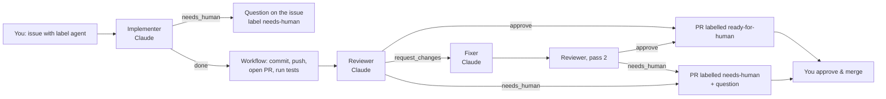

# Sukhumvit live traffic in 3D

A single-page site showing live traffic on Bangkok's Sukhumvit corridor, **Nana BTS → Ekkamai BTS**,
on a 3D map with building extrusions, the BTS stations, and Benjakitti and Benjasiri parks highlighted.
Visitors can rotate and tilt only. It runs at zero cost.

**Live at https://www.ottokorpela.com/bangkoktraffic**, served by the site's Vercel project through
rewrites to this repo's own Vercel project (`sukhumvit-traffic-3d.vercel.app`), which redeploys on every
push to `main`. See *Deploy* below.

It is also a practice ground for **agent-driven development on GitHub**: label an issue `agent` and a
Claude pipeline implements it, reviews its own work, fixes what the reviewer flags, and hands you a PR.
It asks for your view only when the brief is genuinely ambiguous.

## Run it locally

```bash
npm run dev
```

Open http://localhost:3000. No install step; there are no dependencies. The dev server proxies
`/traffic/*` to the published `traffic-data` branch, so you see live tiles as soon as the refresh job
has run once. `/coffee` serves the filter-coffee side project.

```bash
npm test        # tile maths, corridor config, budget
npm run tiles   # print the tile list and the TomTom request budget (no key needed)
TOMTOM_API_KEY=... npm run refresh   # fetch tiles into public/traffic/ for local testing
```

## How it works

```
 browser ──► OpenFreeMap vector tiles (basemap, 3D buildings, parks)         free, no key
    │
    └──────► /traffic/{z}/{x}/{y}.png ──► Vercel rewrite ──► raw.githubusercontent.com
                                                               branch: traffic-data
                                                                     ▲
     GitHub Actions, every 5 min: scripts/refresh-traffic.mjs ───────┘
     fetches the fixed tile set from TomTom (key stays in Actions) and force-pushes
     one commit, so history never grows.
```

| File | Role |
| --- | --- |
| `corridor.js` | Single source of truth: bounds, camera, traffic zoom levels, points of interest. Used by browser and Node. |
| `map.js` | MapLibre map, locked camera with a custom orbit handler, park highlight, traffic raster, status text. |
| `scripts/tiles.mjs` | Pure slippy-map tile maths, shared. |
| `scripts/refresh-traffic.mjs` | Computes the tile list and budget, fetches from TomTom, writes tiles + `updated.json`. |
| `scripts/dev-server.mjs` | Zero-dependency static server with the same `/traffic/` behaviour as production. |
| `vercel.json` | Rewrites `/traffic/*` to the data branch. |
| `coffee/index.html` | Separate finished mini-app, deployed at `/coffee`. |

### Camera lock
The map fits the corridor to the viewport once, then pins that zoom (`minZoom === maxZoom`) and turns
every built-in gesture off. A small pointer handler puts rotate (drag left/right) and tilt (drag up/down)
back, on mouse and touch, and the arrow keys do the same. `R` or the button resets the view. With
`prefers-reduced-motion` there is no intro animation and the reset jumps instead of easing.

### Traffic tiles and the budget
TomTom raster tiles are 256 px, so MapLibre requests tiles one zoom level above the map zoom:
z16 on desktop (map zoom ≈ 15), z15 on phones. The refresh job fetches both, with one tile of padding:

```
z15 (+1): 42 tiles · z16 (+1): 110 tiles · 152 per refresh
every 5 min → 43,776 requests/day  (TomTom free tier: 50,000)
```

`npm run tiles` prints this, `npm test` fails if it goes over. GitHub's shortest schedule is 5 minutes
and runs are often late; for new repositories the cron sometimes does not fire for hours. So the job
is also self-sustaining: while the repository variable `REFRESH_KEEPALIVE` is `true`, each run
re-dispatches itself about five minutes after it started, and any run skips the TomTom fetch when the
published data is under four minutes old, so cron and keep-alive together never exceed the budget.
Set the variable to `false` (Settings → Secrets and variables → Actions → Variables) to rely on cron
alone; run the workflow once by hand to restart the chain. Failed tiles are retried up to
three times, which counts against the budget; if you ever see 429s, drop `padding` to 0 for z16 in
`corridor.js` (~33k/day) or change the cron to `*/6`.

The frontend shows "Traffic updated HH:MM Bangkok time" from `updated.json` and marks it stale after
15 minutes. Before the first refresh it says so instead of failing.

### TomTom terms on caching (checked 2026-09-14)
TomTom's tile responses carry `Cache-Control: private, no-cache, no-store, max-age=0, must-revalidate`,
and the Traffic API documentation contains no clause permitting server-side storage of flow tiles. The
public terms page on `docs.tomtom.com/legal` renders only through JavaScript and I could not read a
caching clause either way; a search summary mentions a 60-day retention limit for downloadable
Traffic Analytics content, which is a different product and unverified. Treat this cache as what it is: a short-lived proxy that re-fetches every 5 minutes and keeps
a single current copy (no history), which is the usual reading of a "no-store" header for a
rate-limited proxy. **Before pointing a real audience at the site, read the current TomTom Developer
Terms yourself and, if in doubt, ask TomTom whether a 5-minute proxy cache is acceptable on the free
tier.** If not, the fallback is to let each visitor fetch tiles from TomTom directly, which reintroduces
the quota problem the cache was built to avoid.

## Deploy (Vercel)

Two Vercel projects, both under the same account:

1. **This repo → its own project.** Vercel dashboard → *Add New* → *Project* → import
   `ottokor/sukhumvit-traffic-3d`. Framework preset **Other**, no build command, output directory `.`
   (root). Deploy. Every push to `main` redeploys, so merged agent PRs go live on their own.
   `vercel.json` rewrites `/traffic/*` to the `traffic-data` branch on raw.githubusercontent.com, whose
   CDN caches each file for up to five minutes.
2. **ottokorpela.com → mounts it at `/bangkoktraffic`.** `next.config.ts` in the site repo has three
   rewrites: `/bangkoktraffic` and `/bangkoktraffic/*` proxy to `sukhumvit-traffic-3d.vercel.app`, and
   `/bangkoktraffic/traffic/*` goes straight to the data branch. `index.html` sets a `<base>` tag when
   served at a path without a trailing slash, so relative asset URLs resolve under `/bangkoktraffic/`.

Nothing in the frontend needs an environment variable. The TomTom key lives only in GitHub Actions.

## Secrets you need to add (GitHub → Settings → Secrets and variables → Actions)

| Secret | Used by | Where to get it |
| --- | --- | --- |
| `TOMTOM_API_KEY` | `refresh-traffic.yml` | developer.tomtom.com → your app → key with Traffic API enabled |
| `CLAUDE_CODE_OAUTH_TOKEN` **or** `ANTHROPIC_API_KEY` | all Claude workflows | `claude setup-token` in a terminal (Claude subscription) **or** console.anthropic.com API key |

Or from a terminal: `gh secret set TOMTOM_API_KEY` (it prompts for the value, nothing is echoed).

To confirm the Claude token works before starting a pipeline, run the **Claude auth check** workflow
from the Actions tab (`claude-auth-check.yml`). It asks Claude for the word "OK" with full output on,
so a `401 OAuth access token is invalid` shows up in plain text instead of a silent pipeline failure.
Test the token locally first with `CLAUDE_CODE_OAUTH_TOKEN=<token> claude -p "say OK"`.

---

## The agent pipeline



Everything runs inside **one workflow run** (`.github/workflows/agent-task.yml`), so it works with the
plain `GITHUB_TOKEN`: no GitHub App to install, no personal access token. Each Claude step returns a
small JSON verdict (`--json-schema`), and ordinary shell steps do the plumbing — branch, commit, PR,
comments, labels. Claude never pushes or comments itself.

### The three roles
Each role has a short brief in `.github/agents/` that you can edit like any other file:

- **implementer.md** – implements the issue on the branch. Rules for when to *stop and ask* instead
  of building: two readings lead to different work; a paid service or new dependency; anything that
  touches secrets or the camera lock; large deletions. Otherwise it decides, states the assumption in
  the PR, and builds.
- **reviewer.md** – checks correctness, the non-negotiables in `CLAUDE.md`, regressions, tests, and
  clarity. Verdicts: `approve`, `request_changes` (fixable by the fixer, no human decision), or
  `needs_human` (a product/design choice you should confirm).
- **fixer.md** – fixes blockers and majors, ignores nits, does not expand scope. One round only; then
  the reviewer's second verdict either approves or hands you the PR with the open question.

### What you do
1. Open an issue with the **Agent task** template (it adds the `agent` label), or add the label to any
   issue. Say up front whether ambiguity should be decided or asked about.
2. Wait for one of two comments on the issue: **✅ Ready for you** (approve and merge the PR), or
   **🙋 Your input is needed** (answer, then re-add the `agent` label, or reply on the PR with `@claude`).
3. Merge. Branch protection on `main` requires one approving review (yours) for every PR, including the
   agent's, and blocks force-pushes.

Labels the pipeline uses: `agent` (start), `agent-working`, `agent-done`, `needs-human`, `ready-for-human`.

### The other Claude workflows
- **`claude.yml`** – mention `@claude` in any issue or PR comment for questions, explanations or a quick
  change. Claude replies in a comment; for code it pushes a branch and links a PR.
- **`pr-review.yml`** – reviews pull requests *you* open, with the same reviewer brief, as one sticky
  comment plus inline notes. Agent branches are skipped (they are reviewed inside the pipeline).
- **`ci.yml`** – syntax check, unit tests, tile budget, and a grep that fails if the frontend ever
  references TomTom or a key. Runs on PRs and pushes to `main`.

### Limits worth knowing
- Pushes made with `GITHUB_TOKEN` do not trigger other workflows, so the pipeline runs the tests itself
  and dispatches CI on the branch explicitly. Installing the Claude GitHub App
  (`/install-github-app` in Claude Code) lifts this; then remove the `github_token:` lines.
- Comments by `github-actions[bot]` do not trigger `claude.yml`, which is deliberate: it prevents agent
  loops. Only your comments start work.
- GitHub disables scheduled workflows in public repositories after 60 days without a commit. A merged
  agent PR counts as activity.
- Each pipeline run is roughly three to five Claude sessions. Keep issues small and specific.
